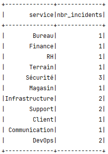
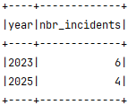

<h1>📚 TP Big Data - Spark SQL</h1>
<br /><br />
<h3>
L'objectif de ce TP est de développer une application de traitement de données avec 
<b>Apache Spark SQL</b> en <b>Java</b>, qui permet de traiter les incidents d'une entreprise 
à partir d'un fichier csv nommé incidents.csv, de la tester en locale puis de la déployer 
sur un cluser Spark sous forme de conteneurs via Docker

</h3>
<br /><br />
<h3>⚙️🛠️ Dépendences de l'application, et outils</h3>
<ul>
<li>Java 8</li>
<li>spark Core</li>
<li>Spark SQL</li>
<li>Maven</li>
</ul>
<br />
🔎 <a href="./pom.xml">Consulter pom.xml pour plus d'information sur les dépendances et les outils utilisés dans le projet</a>
<br />
<br /><br />
<h3>📋 Tâches à faire :</h3>
<ol>
<li>1. Afficher le nombre d’incidents par service.</li>
<li>2. Afficher les 2 années où il y avait beaucoup d'incidents.</li>
</ol>
<br /><br />
<h3>Démo : </h3>
<b>
1. Verifier si vous avez java 17 installée sur votre machine, sinon 
<a href="https://www.oracle.com/java/technologies/javase/jdk17-archive-downloads.html">clicquez ici</a> 
pour l'installer depuis le site officiel d'oracle.
</b>
```
java --version
```

<b>2. Cloner le dépôt (vous devez avoir l'outil git installé)</b>
```
git clone https://github.com/iliasseAbdessamad/TP_SparkSQL.spark
```

<b>3. accéder au projet</b>
```
cd TP_SparkSQL
```

<b>4. Nettoyer et Compiler le projet (cela éstime que vous avez maven installé)</b>
```
mvn clean package
```

<b>5. Lancer l'application</b>
```
java -jar target/sparkSQL-1.0-SNAPSHOT-shaded.jar
```

<br /><br />
<h3>🏁 Résultats attendus</h3>
<b>1. nombre d’incidents par service</b>


<b>2. Les 2 années où il y avait beaucoup d'incidents</b>


</br></br>
<p>
<a href="./src/main/java/me/iliasse/Main.java">
👀 Code source de l'application 
</a>
</p>
<p>
<a href="./incidents.csv">
👀 incidents.csv
</a>
</p>
<p>
<a href="./incidents.csv">
👀 pom.xml
</a>
</p>
<br />
<hr />
<br />
<p>👨‍💻 Réalisé par : Abdessamad Iliasse</p>
<p>📚 Sujet : Batch Processing via Spark SQL</p>
<p>📅 Année : 2024 - 2025</p>
     


